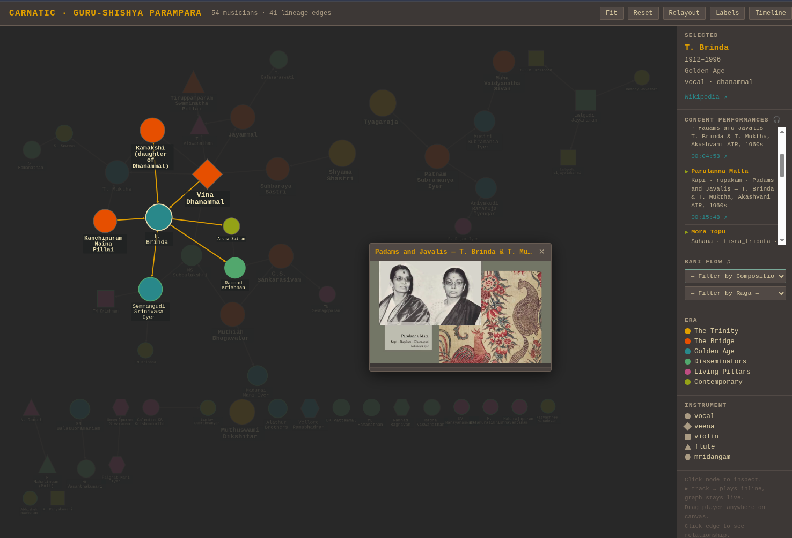

# Guru-Shishya Tree

**GSTree** turns any teacher-student lineage into a self-contained, interactive knowledge graph rendered in the browser — no server, no database, no framework. The first instance maps the **Carnatic classical music** tradition.

[](LICENSE)
[](https://www.python.org/)

---

## Live demo — Carnatic Guru-Shishya Tree

```
carnatic/
  data/musicians.json   ← nodes, edges, recordings (canonical source of truth)
  render.py             ← reads musicians.json → emits graph.html
  crawl.py              ← Wikipedia scraper (disk-cached)
  serve.py              ← zero-dep local server, opens browser automatically
  graph.html            ← derived artefact — regenerate, never hand-edit
```

### Quick start

```bash
# 1. Install
pip install gstree

# — or, from source —
git clone https://github.com/vyaas/gstree.git
cd gstree
pip install -e .

# 2. Regenerate the graph from the bundled data
python3 carnatic/render.py

# 3. Serve locally (YouTube embeds require a real origin, not file://)
python3 carnatic/serve.py          # opens http://localhost:8765/graph.html
python3 carnatic/serve.py 9000     # custom port

# 4. Crawl Wikipedia to discover new lineage edges (optional)
python3 carnatic/crawl.py          # uses disk cache after first run
python3 carnatic/crawl.py --force  # force re-fetch all pages
```

Or use the installed entry-points:

```bash
gstree-render   # equivalent to python3 carnatic/render.py
gstree-crawl    # equivalent to python3 carnatic/crawl.py
gstree-serve    # equivalent to python3 carnatic/serve.py
```

---

## What the graph looks like

| Visual property | Meaning |
|---|---|
| **Node colour** | Era (Trinity → Contemporary) |
| **Node shape** | Instrument (vocal = ellipse, veena = diamond, violin = rectangle, …) |
| **Node size** | Degree centrality — more connections = larger node |
| **Green border** | Node has embedded recordings |
| **Edge thickness** | Confidence of the guru→shishya relationship |

**Interactions**

- **Click a node** — sidebar shows name, lifespan, era, instrument, *bani*; neighbourhood highlighted
- **Click a track** — floating YouTube player appears; music plays while graph stays fully navigable
- **Drag player title bar** — reposition anywhere on canvas
- **Drag player bottom grip** — resize vertically
- **Click an edge** — shows guru→shishya pair, relationship note, confidence %, source URL
- **Double-click a node** — opens Wikipedia in a new tab
- **Buttons** — Fit · Reset · Relayout · Labels (toggle zoom-tiered label override)

---

## Powered by Cytoscape.js

The graph is rendered entirely in the browser using **[Cytoscape.js](https://js.cytoscape.org/)** (v3.28), a battle-tested open-source graph visualisation library for JavaScript.

- **No build step** — `graph.html` is a single self-contained file; Cytoscape.js is loaded from a CDN.
- **Layout** — the [CoSE](https://js.cytoscape.org/#layouts/cose) (Compound Spring Embedder) force-directed layout is used, which handles large, sparse graphs well.
- **Styling** — nodes and edges are styled declaratively via Cytoscape's CSS-like stylesheet API; era colours follow the [Gruvbox](https://github.com/morhetz/gruvbox) palette.
- **Events** — `tap`, `dbltap`, `mouseover`, `zoom` events drive the sidebar, hover popover, and zoom-tiered label system.

Cytoscape.js is MIT-licensed. See [js.cytoscape.org](https://js.cytoscape.org/) for full documentation.

---

## AI-assisted workflow

This project is designed to be extended with an AI agent (Claude, GPT-4, or any capable model) as the primary collaborator for data ingestion:

1. Clone the repo
2. Open a new AI session; drop `carnatic/README.md` + `carnatic/data/musicians.json` as context
3. Drop Wikipedia links, YouTube links, or verbal corrections into the chat
4. The agent fetches, parses, patches `musicians.json`, and regenerates `graph.html`
5. Run `python3 carnatic/serve.py` — opens `http://localhost:8765/graph.html` automatically

The AI does the Wikipedia parsing because it requires judgment, not keyword matching: disambiguating name variants, distinguishing first guru from principal guru, identifying when a prose mention is a genuine lineage statement versus incidental co-occurrence, and assessing whether a newly encountered musician clears the significance threshold.

---

## Extending to other traditions

The pattern generalises to any tradition with a teacher-student lineage:

1. Create a new directory (e.g. `hindustani/`, `jazz/`, `ballet/`)
2. Copy the data model from `carnatic/data/musicians.json` — nodes + edges + optional recordings
3. Copy and adapt `render.py` (era colours, instrument shapes, label tiers)
4. `crawl.py` works against any Wikipedia pages with infobox `teacher`/`student` fields

The Carnatic data is the seed instance. Pull requests adding new traditions are very welcome — see [CONTRIBUTING.md](CONTRIBUTING.md).

---

## Repository layout

```
gstree/
  README.md             ← this file
  CONTRIBUTING.md       ← how to contribute
  LICENSE               ← MIT
  pyproject.toml        ← pip install gstree
  carnatic/
    README.md           ← detailed AI agent briefing for the Carnatic instance
    .clinerules         ← Roo/Cline session rules
    cli.py              ← read-only CLI (stats, lookups, validation)
    write_cli.py        ← atomic write CLI (add-musician, add-edge, add-youtube, …)
    crawl.py            ← Wikipedia scraper
    render.py           ← graph.html generator
    serve.py            ← local HTTP server
    graph.html          ← derived artefact (regenerate, never hand-edit)
    data/
      musicians.json    ← canonical data: nodes, edges, youtube entries
      compositions.json ← ragas, composers, compositions
      READYOU.md        ← data schema and CLI method reference for agents
      recordings/       ← one JSON file per structured concert recording
      cache/            ← Wikipedia page cache (gitignored)
```

---

## License

[MIT](LICENSE) © GSTree Contributors
