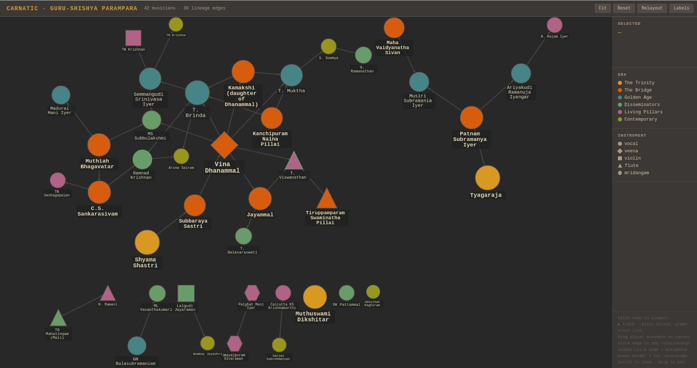

# Carnatic Guru-Shishya Parampara — Knowledge Graph

## What this is

A directed knowledge graph of the *guru-shishya parampara* (teacher-student lineage) of
Carnatic classical music, rendered as a self-contained interactive HTML file using
Cytoscape.js. The graph is traversable, zoomable, every node links to its Wikipedia
page, and nodes with recordings have an embedded YouTube player — music plays inline
while you continue navigating the graph.

The project owner is a serious *rasika* (connoisseur). **Significance is the governing
criterion — not completeness.** A node belongs here if the musician has materially shaped
the sound, transmission, or scholarship of the tradition. Fringe or obscure figures are
excluded unless they are a necessary topological link between two significant nodes.

---

## Open source vision

This project is designed to be **cloned and extended by anyone**, with an AI agent
(Claude or otherwise) as the primary collaborator for data ingestion. The workflow is:

1. Clone the repo
2. Open a new AI session and drop `README.md` + `data/musicians.json` as context
3. Drop Wikipedia links, YouTube links, or verbal corrections into the chat
4. The agent fetches, parses, patches `musicians.json`, and regenerates `graph.html`
5. Run `python3 serve.py` — opens `http://localhost:8765/graph.html` automatically

The AI does the Wikipedia parsing because it requires judgment, not keyword matching:
disambiguating name variants, distinguishing first guru from principal guru, identifying
when a prose mention is a genuine lineage statement versus incidental co-occurrence, and
assessing whether a newly encountered musician clears the significance threshold for this
particular graph.

This pattern generalises: any tradition with a teacher-student lineage, any corpus of
recordings, any set of Wikipedia articles. The Carnatic data is the seed instance.

---

## Repository layout

```
carnatic/
  README.md               <- this file — AI agent briefing + human reference
  crawl.py                <- Wikipedia scraper, updates musicians.json
  render.py               <- reads musicians.json, emits graph.html
  graph.html              <- derived artefact — always regenerate, never hand-edit
  data/
    musicians.json        <- canonical source of truth: nodes, edges, recordings
    cache/
      <md5>.html          <- raw Wikipedia page cache, keyed by URL hash
```

---

## Regenerating the graph

```bash
# install deps once
pip install requests beautifulsoup4

# crawl Wikipedia for all nodes (uses disk cache after first run)
python3 crawl.py

# force re-fetch all Wikipedia pages (e.g. upstream edits)
python3 crawl.py --force

# regenerate graph.html from current musicians.json (no network needed)
python3 render.py
```

**Always open via the local server** — YouTube embeds are blocked when opened
as a `file://` URL (browsers send a `null` origin which YouTube rejects). Serving via
`localhost` gives a real origin, identical to how TiddlyWiki's local server works.

```bash
python3 serve.py          # opens http://localhost:8765/graph.html automatically
python3 serve.py 9000     # custom port if 8765 is taken
```

`serve.py` is a zero-dependency Python wrapper around `http.server` — no installs.
It opens the browser automatically and silences request logs. Stop with `Ctrl+C`.

---

## Session workflow — working with an AI agent

### Starting a session

Provide these files as context at the start of every session:

- `README.md` (this file)
- `data/musicians.json`

The agent reads both before doing anything. The README is the briefing; the JSON is
the current state. Proceed by dropping links or giving verbal instructions.

### Dropping a Wikipedia link

```
https://en.wikipedia.org/wiki/Some_Musician
```

The agent will fetch and parse the page, assess significance, propose nodes and edges,
patch `musicians.json`, run `render.py`, and return the updated `graph.html`.

### Dropping YouTube links

YouTube links **must be annotated** — video metadata is not reliably accessible without
authentication. The agent cannot identify a recording from its URL alone.

**The recommended method is to paste the YouTube video title** alongside the link.
Carnatic recording titles almost always contain the artist name, raga, and event/year —
exactly what is needed for the track `label` and for matching the correct node.

```
https://youtu.be/lNSJJMWLtfc
RTP | Natabhairavi | Adi | Abhishek Raghuram

https://youtu.be/AnNb0zRmauM
Ramnad Krishnan & T Viswanathan | Wesleyan Uni Connecticut USA, 1967 | 106 Birth Anniversary Tribute
```

The agent will:

1. Parse the title to identify the artist(s) — a recording can belong to **multiple
   nodes** (e.g. a duet credits both performers; the same video ID is added to each)
2. Match each artist to an existing node by `label`
3. Extract the 11-character video ID from the URL
4. Construct a clean short `label` from the title
5. Append to each matching node's `youtube` array, skipping duplicates
6. Regenerate `graph.html`

If an artist cannot be matched to an existing node the agent will flag it — it will not
silently drop the recording or create an unevaluated node.

### Verbal corrections

```
"The Semmangudi → Ramnad Krishnan edge is wrong, remove it"
"Add a note: Brinda taught Semmangudi padams specifically"
"Sanjay's principal guru was Calcutta KS Krishnamurthi, not Semmangudi"
```

The agent patches `musicians.json` using the established Python patch pattern (load,
modify, check for duplicate keys, save). It never edits `graph.html` by hand.

---

## Data model

### Node fields (`musicians.json → nodes[]`)

| field | type | notes |
|---|---|---|
| `id` | string | snake_case, unique, **never rename once set** |
| `label` | string | display name as commonly known |
| `wikipedia` | string | canonical Wikipedia URL |
| `born` / `died` | int \| null | year only; `null` if living or unknown |
| `era` | enum | see Era vocabulary below |
| `instrument` | enum | see Instrument vocabulary below |
| `bani` | string | stylistic school/lineage label (free text) |
| `youtube` | array | list of `{url, label}` recording objects |

### YouTube recording format

```json
"youtube": [
  {
    "url":   "https://youtube.com/watch?v=XXXXXXXXXXX",
    "label": "Raga name — context / year / event"
  },
  {
    "url":   "https://youtu.be/YYYYYYYYYYY",
    "label": "Another recording"
  }
]
```

Any YouTube URL form is accepted (`watch?v=`, `youtu.be/`, `embed/`). The renderer
extracts the 11-character video ID and constructs a `youtube-nocookie.com` embed URL.
The `label` is what appears in the track list — keep it concise but informative.
Nodes with at least one recording show a **green border** in the graph.

### Edge fields (`musicians.json → edges[]`)

| field | type | notes |
|---|---|---|
| `source` | node id | the **guru** |
| `target` | node id | the **shishya** |
| `confidence` | float 0–1 | see Confidence scale below |
| `source_url` | string | URL where this relationship is explicitly stated |
| `note` | string | optional qualifier on the relationship |

### Era vocabulary

| value | meaning |
|---|---|
| `trinity` | The three 18th-century composer-saints |
| `bridge` | 19th–early 20th century figures connecting the Trinity to the modern tradition |
| `golden_age` | Architects of the modern concert format (~1890–1950) |
| `disseminator` | Mid-20th century figures who carried the tradition outward |
| `living_pillars` | Active or recently deceased figures who defined contemporary practice |
| `contemporary` | Active musicians defining the current era |

### Instrument vocabulary

`vocal`, `veena`, `violin`, `flute`, `mridangam`, `bharatanatyam`

Add new values freely — each gets a distinct node shape in the graph automatically.

### Confidence scale

| value | meaning |
|---|---|
| 0.95–1.0 | Explicitly stated in Wikipedia infobox or unambiguous prose |
| 0.85–0.94 | Clearly implied, cross-confirmed across multiple pages |
| 0.70–0.84 | Single prose source, or confirmed 2-hop lineage |
| below 0.70 | Speculative — must carry a `note` explaining the uncertainty |

---

## Instructions for the AI agent — adding a musician

1. **Fetch the Wikipedia page.** Extract: infobox `teacher`/`students` fields; prose
   patterns (`disciple of`, `trained under`, `student of`, `guru was`, `learnt from`);
   lead paragraph lineage statements. Infoboxes are inconsistent in Carnatic music
   articles — many bury lineage in prose only.

2. **Check for name variant collisions.** The same musician often appears as a full
   formal name, a common short name, a spelling variant, or initials. Check all existing
   node `label` fields before creating a new node.

3. **Assess significance.** Would a knowledgeable *rasika* recognise this name? Did this
   person win a Sangeetha Kalanidhi, or train someone who did? Are they a necessary
   topological link between two existing significant nodes? The Sangeetha Kalanidhi
   recipient list (Wikipedia) is a reliable significance filter.

4. **Assess relationship type carefully.** Use the `note` field to distinguish:
   - `"first guru"` — foundational early training
   - `"principal guru"` — dominant mature influence
   - `"gurukula training, N years"` — residential study
   - `"via <person> (2-hop)"` — confirmed through an intermediate not yet in the graph

5. **Do not infer edges from shared *bani*.** Shared stylistic school is not evidence
   of direct teacher-student relationship. Require an explicit statement.

6. **Patch `musicians.json` using Python.** Load → check for duplicate `id` and
   `(source, target)` keys → append → save. Log every change with `[NODE+]`, `[EDGE+]`,
   `[EDGE-]`, `[EDGE~]` prefixes. Never edit `graph.html` by hand.

7. **Run `python3 render.py`.** Confirm node and edge counts change as expected.

---

## Known open questions

- **Vina Dhanammal's connection to the Trinity** — now partially resolved: Dhanammal's
  mother trained under Subbaraya Sastri (son of Shyama Shastri), giving a clean
  `shyama_shastri → subbaraya_sastri → vina_dhanammal` chain. The edge from Subbaraya
  Sastri to Dhanammal is via her mother (confidence 0.90), not direct tutelage of
  Dhanammal herself — the `note` field records this.

- **T. Viswanathan's guru** — corrected. His formal guru was Tiruppamparam Swaminatha
  Pillai (~20 years of study). The `vina_dhanammal → t_viswanathan` edge is retained at
  0.85 with a note clarifying it represents inherited family *bani*, not direct tutelage.
  The `swaminatha_pillai → t_viswanathan` edge (0.97) is now the primary guru edge.

- **T. Muktha's dates** — corrected to born 1914, died 2007 (was 1909/1999). The
  lineage note now correctly names Kamakshi (not Jayammal) as the intermediate.

- **T. Balasaraswati** — added (1918–1984). Sangeetha Kalanidhi 1973, Padma Vibhushan
  1977. Primarily a Bharatanatyam dancer; instrument field uses `bharatanatyam`. Her
  musical lineage runs `vina_dhanammal → jayammal → t_balasaraswati`.

- **T. Ranganathan** (1925–1987, mridangam) — brother of Balasaraswati and Viswanathan.
  No Wikipedia article found; excluded per project rules (no Wikipedia page = no node).

- **Kamakshi and Jayammal** — added as intermediate nodes. Both are daughters of
  Dhanammal and necessary topological links to the grandchildren generation.

- **Kanchipuram Naina Pillai** — added. Taught both T. Brinda and T. Muktha for a
  "substantial length of time" (Wikipedia). Dates unknown.

- **MS Subbulakshmi** has two guru edges: Muthiah Bhagavatar (first guru, 0.95) and
  Semmangudi Srinivasa Iyer (second guru, 0.85). Both correct; `note` distinguishes them.
  Her `bani` field is `dhanammal` — this reflects her stylistic affiliation via T. Brinda
  and the Dhanammal school, not a direct guru relationship with Dhanammal herself.

- **Madurai Mani Iyer's** lineage before Muthiah Bhagavatar is unestablished.

- **The mridangam lineage** is underrepresented. Palghat Mani Iyer and Umayalpuram
  Sivaraman are present; key students (Trichy Sankaran, Karaikudi Mani, Guruvayur Dorai)
  have not been added.

- **C.S. Sankarasivam's** dates are unknown (`born/died: null`). Confirmed disciple of
  Muthiah Bhagavatar; confirmed guru of both Ramnad Krishnan and T.N. Seshagopalan.

- **Sanjay Subrahmanyan** also studied under Semponarkoil S.R.D. Vaidyanathan
  (2002–2013). Vaidyanathan not yet assessed for significance as a standalone node.

- **The GNB lineage** downstream of ML Vasanthakumari is not yet mapped.

- **Lalgudi Jayaraman's** own guru (Tirukodikaval Krishna Iyer) is not yet a node.

- **Subbaraya Sastri's dates** — set to 1803–1876 based on standard references; verify
  against a primary source if precision matters.

- **Kanchipuram Naina Pillai's Wikipedia page** — the article title may differ; the
  current `wikipedia` URL should be verified and corrected if the page does not exist.

---

## Interaction guide (graph.html)

- **Click a node** — sidebar shows name, lifespan, era, instrument, *bani*.
  Neighbourhood highlighted; rest faded.
- **Green border** on a node — has recordings attached.
- **Click a track in sidebar** — floating YouTube player appears over the graph.
  Music plays; graph remains fully navigable beneath it.
- **Drag player title bar** — reposition anywhere on the canvas.
- **Drag player bottom grip** — resize vertically.
- **Click an edge** — shows guru→shishya pair, relationship note, confidence %,
  and source URL.
- **Double-click a node** — opens Wikipedia in a new tab.
- **Click background** — clears selection.
- **Buttons** — Fit, Reset, Relayout, Labels (toggle zoom-tiered labels override).
- **Node colour** — era. **Node shape** — instrument. **Node size** — degree centrality.
- **Edge thickness** — confidence.
- **Zoom-tiered labels** — Trinity/Bridge always visible; Golden Age/Disseminators at
  zoom ≥ 0.45; others at zoom ≥ 0.72.


